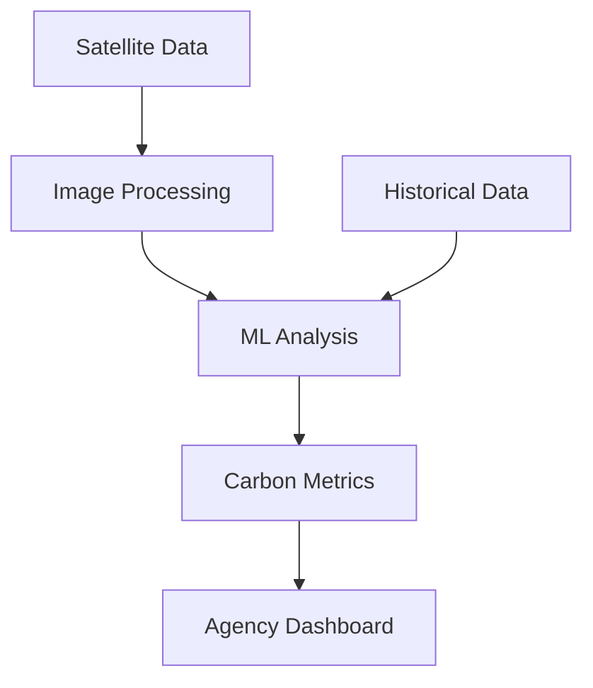

# CarbonAI/README.md

# 🌿 CarbonAI - Carbon Footprint Analysis Platform

## 🔍 Overview
CarbonAI leverages machine learning and satellite imagery to revolutionize urban carbon footprint analysis. Our platform helps environmental agencies and cities track, measure, and reduce their carbon emissions through advanced AI technology.

## 🌟 Key Features
- Real-time satellite imagery analysis
- Urban heat island detection with 94% accuracy
- Automated carbon emission measurements
- Interactive dashboard for environmental agencies
- Comprehensive API for data integration

## 🏗️ Architecture

## 🚀 Getting Started
1. Clone repository: `git clone https://github.com/your-username/carbonai.git`
2. Install dependencies: `pip install -r requirements.txt`
3. Configure environment: Copy `.env.example` to `.env`
4. Run application: `python src/main.py`

## 📊 Impact Metrics
- 94% detection accuracy
- 85% faster calculations
- Supporting 3 environmental agencies
- 500+ daily satellite images processed
- 30% reduction in analysis costs

## 🛠️ Tech Stack
- Python 3.9+
- TensorFlow 2.x
- Google Cloud Vision API
- FastAPI
- PostgreSQL
- Docker
